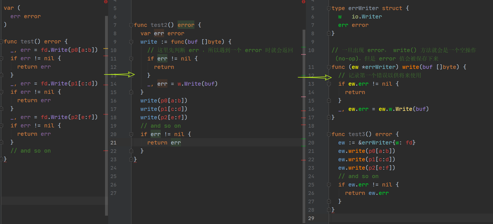

# Errors are values

原文地址：[Errors are values](https://blog.golang.org/errors-are-values)

Values can be programmed, and since errors are values, errors can be programmed.

如 bufio 包中 `Scanner` 类型，其 `Scan()` 方法调用了底层 I/O，显然该方法会导致 error(注意，即使正常扫描完文件，也会产生 EOF - End of File 错误)，但是 `Scan()` 方法并不暴露 error，而是在扫描停止时(到达了文件末尾或产生 error)返回一个 bool 值，error 则会被记录，用户可以通过一个单独的方法 `Err()` 来查看扫描过程中的产生的 error，如果是 EOF 错误则 `Err()` 返回 nil。

```go
scanner := bufio.NewScanner(input)
for scanner.Scan() {
  token := scanner.Text()
  // todo process token
}
if err := scanner.Err(); err != nil {
  // todo process err
}
```

如果自定义一个 `func (s *Scanner) Scan() (token []byte, error)`，此时，上述代码也许会变为：

```go
scanner := bufio.NewScanner(input)
for {
  token, err := scanner.Scan()
  if err != nil {
      return err // or maybe break
  }
  // process token
}
```

这两者差别并不大，但是在后者中，用户必须在每次迭代后都检查 error，而在真正的 `Scanner` API 中，error 的处理被抽离出来了，代码逻辑会显得很自然：循环，直到结束，然后再处理 error。错误处理不会掩盖控制流。

 `Scanner` 的这种处理很简单，不同于到处写 `if err!=nil` 或要求用户在每个 token 后检查错误。这正是对 error 值的编程！示例：



实际上，这种模式在标准库中很常见，如 `archive/zip` 和 `net/http` 都用到了。而 `bufio` 包的 `Writer` 类型实际就是上面 `errWriter` 思想的实现，尽管其 `Write()` 方法返回了一个 error，这是为了实现了 `io.Writer` 接口，该方法的行为就像上面示例中的 `errWriter.Write()` 方法那样，再通过 `Flush()` 来报告 error：

```go
func test(){
  b := bufio.NewWriter(fd)
  b.Write(p0[a:b])
  b.Write(p1[c:d])
  b.Write(p2[e:f])
  // and so on
  if b.Flush() != nil {
      return b.Flush()
  }
}
```

这种方法有一个显著的缺点：对于一些应用而言，我们**无从得知在 error 产生之前完成了多少处理**。如果这一信息很重要，就需要更细粒度的方法了。不过，通常而言，在末尾处进行一次全部完成或全部未完成的检查就足够了。

# Working with Errors in Go 1.13

原文地址：[Working with Errors in Go 1.13](https://blog.golang.org/go1.13-errors)

## before Go 1.13

- Examining errors(检查错误)

```go
// 通常将 err 和 nil 比较来查看是否有操作失败
if err != nil {
  // something went wrong
}

// 偶尔会将 err 和一个已知的哨兵值(sentinel value)比较，看是否出现了这个指定的 error
var ErrNotFound = errors.New("not found")

if err == ErrNotFound {
  // something wasn't found
}

// 使用类型断言或 type switch 来将一个 error 值当作一个更具体的类型
type NotFoundError struct {
  Name string
}

func (e *NotFoundError) Error() string { return e.Name + ": not found" }

if e, ok := err.(*NotFoundError); ok {
  // e.Name wasn't found
}
```

- Adding information(添加信息)

函数通常在向调用栈中传递一个 error 时会添加信息，如 error 产生时所发生的行为的简短描述：

```go
if err != nil {
  return fmt.Errorf("decompress %v: %v", name, err)
}
```

使用 `fmt.Errorf()` 创建的 error 仅保留文本信息而丢弃原始 error 的其他信息！

有时想要定义一个包含了底层 error 的新的错误类型：

```go
type QueryError struct {
  Query string
  Err   error
}
// 程序可以查看 *QueryError 内部的值，并基于底层的 error 做出判断，这也被当作 error 的 unwrapping
if e, ok := err.(*QueryError); ok && e.Err == ErrPermission {
  // query failed because of a permission problem
}
```

标准库中的 `os.PathError` 类型就是一个应用实例：

```go
// PathError records an error and the operation and file path that caused it.
type PathError struct {
  Op   string
  Path string
  Err  error
}
```

## Errors in Go 1.13

- The Unwrap method

Go 1.13 向 `errors` 和 `fmt` 包中引入了一种新特性用于简化 error(包含了另一种 error) 的使用。

一个包含了另一种 error 的 error 可以实现一个 `Unwrap()` 方法，用于返回底层的 error。如果 `e1.Unwrap()` 返回 `e2`，就认为 `e1` 包装(wrap)了 `e2`。所以，之前的 `QueryError` 可以定义一个方法：

```go
func (e *QueryError) Unwrap() error {
  return e.Err
}
```

当然，unwrap 的结果可能本身也实现了 `Unwrap()` 方法，这就是错误链(error chain)。

- Examining errors with Is and As

Go 1.13 的 `errors` 包中包含了两个用于检查错误的新的函数：`Is()` 、`As()`。

`errors.Is(err, target error)` 会将 err 和 target 做比较：

```go
// Similar to:
//  if err == ErrNotFound { … }
if errors.Is(err, ErrNotFound) {
  // something wasn't found
}
```

`errors.As(err error, target interface{})` 用于测试 err 是否是 target 类型：

```go
// Similar to:
//  if e, ok := err.(*QueryError); ok { … }
var e *QueryError
if errors.As(err, &e) {
  // err is a *QueryError, and e is set to the error's value
}
```

示例：

```go
if e, ok :‘
= err.(*QueryError); ok && e.Err == ErrPermission {
    // query failed because of a permission problem
}
// 上面的代码可以写作：
if errors.Is(err, ErrPermission) {
    // err, or some error that it wraps, is a permission problem
}
```

`errors` 包还有一个 `Unwrap(err error)` 函数，如果 err 本身有 `Unwrap()` 方法，`errors.Unwrap(err error)` 会返回调用 err 的 `Unwrap()` 方法的返回值，如果 err 并没有 `Unwrap()` 方法，则 `errors.Unwrap(err error)` 返回 nil。

- 利用 `%w` 包装 errors

前面提到，通常使用 `fmt.Errorf()` 来向一个 error 添加额外的信息，在 Go 1.13 中，`fmt.Errorf()` 支持 `%w`，如果用到了 `%w`，则 `fmt.Errorf()` 返回的 error 自带 `Unwrap()` 方法，且 `Unwrap()` 方法的返回值即为 `%w` 对应的错误。

```go
func TestW(t *testing.T) {
	err := fmt.Errorf("access denied: %w", os.ErrPermission)
	t.Log(err) // access denied: permission denied
	t.Log(errors.Unwrap(err)) // permission denied
	// 输出 true
	if errors.Is(err, os.ErrPermission) {
		// 第二个参数必须时一个接口
		if errors.As(err, &os.ErrPermission) {
			t.Log(true)
		}
	}
}
```

- Whether to Wrap

无论是 `fmt.Errorf()` 还是实现一个自定义的 error 类型，在向其添加额外的内容时，都应考虑这个新的 error 是否要包装一个原始的 error。

`Parse()` 函数要从 `io.Reader` 中读取一个复杂的数据结构，如果产生了错误，我们希望报告错误出现的行号和列号。如果在从 `io.Reader` 中读取时产生错误，


kit 库返回的 root error 是否只能在调用 kit 库函数时对 error Wrap 一次，而在最上层对 error 处理，比如打印日志或者返回降级数据，而中间的调用则直接返回 err？比如 A——>B——C——>kit ，只在 C 里对 error Wrap，在 A 中打印日志，而 B 则是 return err